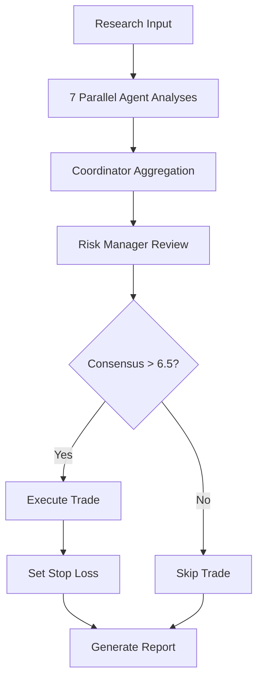

# Agent Collaboration Framework

## How The 7 Agents Work Together

### The Trading Decision Pipeline



## Agent Responsibilities & Interactions

### 1. Parallel Analysis Phase (7:00-7:10 AM)

Each agent independently analyzes the trading opportunity:

```python
# Each agent receives the same input
input_data = {
    'symbol': 'MFIC',
    'current_price': 12.16,
    'catalyst': 'Insider buying',
    'market_data': {...}
}

# Agents analyze in parallel
fundamental_score = fundamental_analyst.analyze(input_data)  # Returns: 7.5/10
technical_score = technical_analyst.analyze(input_data)      # Returns: 8.0/10
news_score = news_analyst.analyze(input_data)               # Returns: 9.0/10
sentiment_score = sentiment_analyst.analyze(input_data)      # Returns: 7.0/10
```

### 2. Synthesis Phase (7:10-7:15 AM)

Bull and Bear researchers synthesize all analyses:

```python
# Bull Researcher sees all positive signals
bull_input = {
    'fundamental': 7.5,  # Strong fundamentals
    'technical': 8.0,    # Breakout pattern
    'news': 9.0,         # Insider buying catalyst
    'sentiment': 7.0     # Positive social buzz
}
bull_case = bull_researcher.build_case(bull_input)  # Returns: 8.5/10

# Bear Researcher identifies risks
bear_input = {
    'market_conditions': 'volatile',
    'sector_weakness': False,
    'company_risks': 'minimal'
}
bear_case = bear_researcher.assess_risks(bear_input)  # Returns: 4.0/10 (low risk)
```

### 3. Consensus Calculation (7:15-7:17 AM)

The Coordinator aggregates all scores:

```python
def calculate_consensus(agent_scores):
    weights = {
        'fundamental': 0.20,
        'technical': 0.20,
        'news': 0.15,
        'sentiment': 0.10,
        'bull': 0.15,
        'bear': 0.15,
        'risk': 0.05
    }
    
    consensus = sum(
        score * weights[agent] 
        for agent, score in agent_scores.items()
    )
    
    return consensus  # Example: 7.43/10
```

### 4. Risk Manager Decision (7:17-7:20 AM)

The Risk Manager has final say with VETO power:

```python
class RiskManager:
    def evaluate_trade(self, consensus_score, portfolio_metrics):
        # Check consensus threshold
        if consensus_score < 6.5:
            return {'decision': 'REJECT', 'reason': 'Low consensus'}
        
        # Check portfolio risk
        if portfolio_metrics['var_95'] > portfolio_metrics['max_var']:
            return {'decision': 'REJECT', 'reason': 'Portfolio risk too high'}
        
        # Check position concentration
        position_size = self.calculate_position_size(
            portfolio_value=portfolio_metrics['value'],
            risk_score=consensus_score,
            volatility=portfolio_metrics['stock_volatility']
        )
        
        if position_size > portfolio_metrics['max_position_size']:
            position_size = portfolio_metrics['max_position_size']
        
        # Check correlation with existing positions
        if self.check_correlation(symbol, portfolio_metrics['positions']) > 0.8:
            return {'decision': 'REJECT', 'reason': 'High correlation'}
        
        # APPROVE with calculated parameters
        return {
            'decision': 'APPROVED',
            'position_size': position_size,
            'stop_loss': self.calculate_stop_loss(consensus_score),
            'risk_score': self.calculate_risk_score(all_factors)
        }
```

## Agent Communication Examples

### Successful Trade Approval

```json
{
  "timestamp": "2025-09-16T07:18:00Z",
  "symbol": "MFIC",
  "coordinator_summary": {
    "fundamental": {"score": 7.5, "signal": "BUY"},
    "technical": {"score": 8.0, "signal": "BUY"},
    "news": {"score": 9.0, "signal": "STRONG_BUY"},
    "sentiment": {"score": 7.0, "signal": "BUY"},
    "bull": {"score": 8.5, "strength": "HIGH"},
    "bear": {"score": 4.0, "risk": "LOW"},
    "consensus": 7.43
  },
  "risk_manager_decision": {
    "status": "APPROVED",
    "position_size_shares": 770,
    "position_size_pct": 9,
    "entry_price": 12.16,
    "stop_loss": 11.07,
    "target": 15.80,
    "risk_reward_ratio": "1:3"
  }
}
```

### Trade Rejection Example

```json
{
  "timestamp": "2025-09-16T07:25:00Z",
  "symbol": "XYZ",
  "coordinator_summary": {
    "fundamental": {"score": 5.0, "signal": "HOLD"},
    "technical": {"score": 4.5, "signal": "SELL"},
    "news": {"score": 6.0, "signal": "NEUTRAL"},
    "sentiment": {"score": 3.0, "signal": "BEARISH"},
    "bull": {"score": 4.0, "strength": "LOW"},
    "bear": {"score": 8.0, "risk": "HIGH"},
    "consensus": 4.95
  },
  "risk_manager_decision": {
    "status": "REJECTED",
    "reason": "Consensus below threshold (4.95 < 6.5)",
    "additional_risks": [
      "High bear case score (8.0)",
      "Negative sentiment (3.0)",
      "Weak technicals"
    ]
  }
}
```

## Agent Specializations

### Fundamental Analyst
**Focus**: Company financials and valuation
```python
def analyze(self, symbol):
    metrics = {
        'pe_ratio': get_pe_ratio(symbol),
        'revenue_growth': get_revenue_growth(symbol),
        'debt_to_equity': get_debt_ratio(symbol),
        'profit_margins': get_margins(symbol)
    }
    
    score = 0
    if metrics['pe_ratio'] < sector_average:
        score += 2.5  # Undervalued
    if metrics['revenue_growth'] > 0.15:
        score += 2.5  # Strong growth
    # ... more checks
    
    return {'score': score, 'metrics': metrics}
```

### Technical Analyst
**Focus**: Chart patterns and indicators
```python
def analyze(self, symbol):
    indicators = {
        'rsi': calculate_rsi(symbol),
        'macd': calculate_macd(symbol),
        'support': find_support_level(symbol),
        'resistance': find_resistance_level(symbol),
        'volume': analyze_volume_pattern(symbol)
    }
    
    signals = []
    if indicators['rsi'] > 30 and indicators['rsi'] < 70:
        signals.append('neutral_rsi')
    if indicators['macd']['signal'] == 'bullish_cross':
        signals.append('macd_buy')
    
    score = len([s for s in signals if 'buy' in s]) * 2.5
    return {'score': score, 'indicators': indicators}
```

### News Analyst
**Focus**: Breaking news and catalysts
```python
def analyze(self, symbol):
    news_items = fetch_recent_news(symbol)
    
    catalyst_strength = 0
    for item in news_items:
        sentiment = analyze_sentiment(item['text'])
        impact = assess_impact(item['headline'])
        
        if 'insider buying' in item['text'].lower():
            catalyst_strength += 3.0
        if 'earnings beat' in item['text'].lower():
            catalyst_strength += 2.0
        # ... more catalyst checks
    
    return {
        'score': min(catalyst_strength, 10),
        'top_catalysts': extract_catalysts(news_items)
    }
```

### Sentiment Analyst
**Focus**: Social media and market sentiment
```python
def analyze(self, symbol):
    sentiment_data = {
        'twitter': get_twitter_sentiment(symbol),
        'reddit': get_reddit_mentions(symbol),
        'stocktwits': get_stocktwits_sentiment(symbol),
        'options_flow': analyze_options_flow(symbol)
    }
    
    # Weight different sources
    weighted_sentiment = (
        sentiment_data['twitter'] * 0.3 +
        sentiment_data['reddit'] * 0.2 +
        sentiment_data['stocktwits'] * 0.2 +
        sentiment_data['options_flow'] * 0.3
    )
    
    return {
        'score': weighted_sentiment,
        'sources': sentiment_data
    }
```

### Bull Researcher
**Focus**: Identifying opportunities
```python
def build_case(self, all_analyses):
    bull_factors = []
    
    if all_analyses['fundamental']['score'] > 7:
        bull_factors.append('strong_fundamentals')
    if all_analyses['technical']['breakout']:
        bull_factors.append('technical_breakout')
    if all_analyses['news']['catalyst_count'] > 2:
        bull_factors.append('multiple_catalysts')
    
    bull_score = len(bull_factors) * 2.5 + 
                 all_analyses['sentiment']['score'] * 0.1
    
    return {
        'score': min(bull_score, 10),
        'factors': bull_factors,
        'thesis': generate_bull_thesis(bull_factors)
    }
```

### Bear Researcher
**Focus**: Identifying risks
```python
def assess_risks(self, symbol, market_conditions):
    risk_factors = []
    
    # Company-specific risks
    if get_debt_ratio(symbol) > 2.0:
        risk_factors.append('high_debt')
    if get_insider_selling(symbol) > threshold:
        risk_factors.append('insider_selling')
    
    # Market risks
    if market_conditions['vix'] > 25:
        risk_factors.append('high_volatility')
    if sector_performance(symbol) < -5:
        risk_factors.append('weak_sector')
    
    bear_score = len(risk_factors) * 2.0
    
    return {
        'score': min(bear_score, 10),
        'risks': risk_factors,
        'downside_target': calculate_downside(risk_factors)
    }
```

### Risk Manager
**Focus**: Portfolio protection and position sizing
```python
def evaluate(self, symbol, consensus, portfolio):
    risk_checks = {
        'consensus_threshold': consensus > 6.5,
        'portfolio_var': calculate_var(portfolio) < max_var,
        'position_concentration': check_concentration(portfolio),
        'correlation': check_correlation(symbol, portfolio),
        'market_conditions': assess_market_risk()
    }
    
    if not all(risk_checks.values()):
        return {
            'decision': 'REJECT',
            'failed_checks': [k for k, v in risk_checks.items() if not v]
        }
    
    # Calculate position parameters
    position_size = calculate_kelly_criterion(
        win_rate=portfolio['win_rate'],
        avg_win=portfolio['avg_win'],
        avg_loss=portfolio['avg_loss']
    ) * safety_factor
    
    stop_loss = calculate_atr_stop(symbol) * risk_multiplier
    
    return {
        'decision': 'APPROVED',
        'position_size': position_size,
        'stop_loss': stop_loss,
        'checks_passed': risk_checks
    }
```

## Consensus Scenarios

### Scenario 1: Strong Buy Signal
- All agents align positively
- Consensus > 8.0
- Risk Manager approves with larger position size

### Scenario 2: Mixed Signals
- Some agents positive, others negative
- Consensus 5.5-6.5
- Risk Manager may approve with reduced position size

### Scenario 3: Risk Manager Veto
- Good consensus (>6.5)
- But portfolio risk too high
- Risk Manager overrides and rejects

### Scenario 4: Unanimous Rejection
- All agents negative
- Consensus < 4.0
- Automatic rejection

## Performance Tracking

Each agent's performance is tracked:

```python
agent_performance = {
    'fundamental': {
        'accuracy': 0.72,  # 72% correct predictions
        'avg_score_winners': 7.8,
        'avg_score_losers': 4.2
    },
    'technical': {
        'accuracy': 0.68,
        'best_indicators': ['MACD', 'RSI'],
        'worst_indicators': ['Stochastic']
    },
    'news': {
        'accuracy': 0.81,  # Best performer
        'top_catalysts': ['insider_buying', 'earnings_beat']
    }
    # ... etc for all agents
}

# Weights can be adjusted based on performance
def update_agent_weights(performance_data):
    for agent, metrics in performance_data.items():
        if metrics['accuracy'] > 0.75:
            weights[agent] *= 1.1  # Increase weight
        elif metrics['accuracy'] < 0.50:
            weights[agent] *= 0.9  # Decrease weight
```

## Emergency Override System

```python
class EmergencyOverride:
    def check_conditions(self, market_data):
        if market_data['vix'] > 40:
            return 'HALT_ALL_TRADING'
        
        if portfolio_drawdown > 0.10:
            return 'REDUCE_POSITION_SIZES'
        
        if correlation_spike_detected():
            return 'CLOSE_CORRELATED_POSITIONS'
        
        return 'NORMAL_OPERATIONS'
```

---

*This collaborative framework ensures every trade is analyzed from multiple perspectives before execution, with proper risk management at every step.*