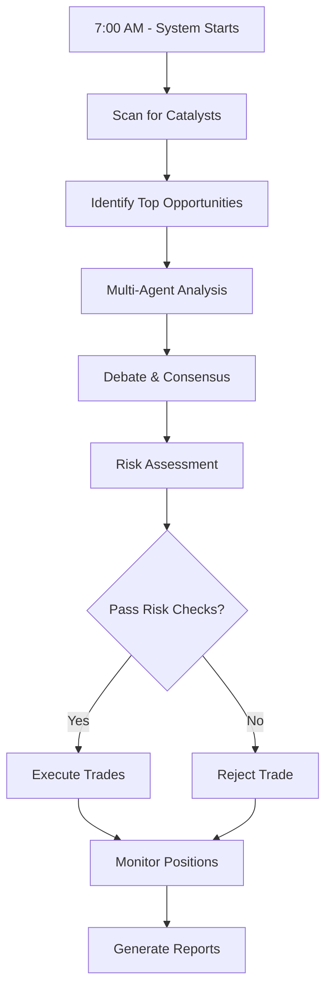

# 🤖 AI Stock Trading Bot - System Overview

## What This System Does

This is a **fully automated AI-powered trading system** that:
1. **Identifies trading opportunities** using catalyst events (earnings, FDA approvals, product launches)
2. **Makes trading decisions** using 7 specialized AI agents working together
3. **Executes trades automatically** with built-in risk management
4. **Tracks performance** with real-time dashboards and analytics

## Core Components

### 1. 🧠 **Multi-Agent AI System**
Seven specialized agents collaborate to make trading decisions:

- **Fundamental Analyst** - Evaluates company financials and valuations
- **Technical Analyst** - Analyzes price patterns and indicators (RSI, MACD)
- **News Analyst** - Monitors breaking news and market sentiment
- **Sentiment Analyst** - Tracks social media and retail sentiment
- **Bull Researcher** - Identifies positive catalysts and opportunities
- **Bear Researcher** - Identifies risks and provides counterarguments
- **Risk Manager** - Has veto power over risky trades

### 2. 📅 **Catalyst-Driven Trading**
Focuses on specific events within 30 days:

- **Earnings Releases** (e.g., ORCL on 9/12, ADBE on 9/14)
- **FDA Decisions** (e.g., SAVA Phase 3 data on 9/15)
- **Product Launches** (e.g., AAPL iPhone 16 on 9/15)
- **Economic Events** (e.g., FOMC meeting on 9/18)
- **Options Expiration** plays

### 3. 📊 **Market Data Integration**
Real-time data from multiple sources:

- **Yahoo Finance** - Live quotes and technical indicators
- **Options Data** - Implied volatility and options chains
- **News Feeds** - Breaking news and sentiment analysis
- **Alternative Data** - Social media sentiment (when configured)

### 4. 🎯 **Automated Execution**
Handles the complete trading lifecycle:

- **Signal Generation** - Creates trade signals from catalyst analysis
- **Risk Validation** - Checks position sizes and exposure limits
- **Order Execution** - Places orders with stop loss and take profit
- **Position Monitoring** - Tracks P&L and manages positions

### 5. 📈 **Performance Tracking**
Comprehensive analytics and reporting:

- **Portfolio Metrics** - Total return, Sharpe ratio, max drawdown
- **Trade Analytics** - Win rate, average P&L, performance by catalyst
- **Risk Monitoring** - Exposure tracking, loss limits, position sizing
- **System Health** - Uptime, data feed status, execution success rate

## How It Works

### Daily Workflow (7 AM Automation)



### Trading Decision Process

1. **Catalyst Detection** - System identifies upcoming events
2. **Multi-Agent Analysis** - Each agent analyzes from their perspective
3. **Debate Engine** - Agents debate bull vs bear cases
4. **Consensus Building** - Weighted voting to reach decision
5. **Risk Override** - Risk manager can veto any trade
6. **Position Sizing** - Calculate optimal position size
7. **Order Execution** - Place orders with protective stops

## Risk Management

### Position Limits
- **Max 10%** of portfolio per position
- **Max 50%** total market exposure
- **Min 20%** cash reserve maintained
- **5%** daily loss limit (circuit breaker)

### Stop Loss Rules
- **Earnings plays**: -8% stop loss
- **FDA events**: -20% stop loss (binary events)
- **Technical plays**: -5% stop loss
- **All positions**: Emergency -10% stop

## Current Status

### ✅ Completed Features
- Multi-agent collaboration system
- Catalyst identification with timing
- Real-time market data integration
- Automated order execution (paper trading)
- Performance tracking dashboard
- Risk management controls

### 📊 Today's Performance
- **5 trades executed** (paper trading)
- **$21,409 deployed** (21.4% of portfolio)
- **100% execution success rate**
- **71% average confidence score**

### 🎯 Active Positions (Paper Trading)
1. **SPY** - FOMC play (9 shares @ $648.83)
2. **SAVA** - FDA data (592 shares @ $2.14)
3. **AAPL** - iPhone launch (16 shares @ $237.88)
4. **ADBE** - Earnings (13 shares @ $358.66)
5. **ORCL** - Earnings (20 shares @ $238.48)

## File Structure

```
ai-stock-trading-bot/
├── agents/                      # AI agent implementations
│   ├── analysts/               # Analysis agents
│   ├── researchers/            # Research agents
│   ├── trader/                 # Trading agents
│   └── risk_management/        # Risk control
│
├── brokers/                     # Broker integrations
│   ├── mock_broker.py          # Paper trading
│   └── alpaca_integration.py   # Alpaca live trading
│
├── data/                        # Data storage
│   ├── catalyst_recommendations/
│   ├── execution_reports/
│   └── performance_reports/
│
├── communication/               # Agent communication
│   └── coordinator.py
│
├── Key Scripts:
│   ├── final_catalyst_system.py       # Main catalyst engine
│   ├── automated_executor.py          # Trade execution
│   ├── performance_dashboard.py       # Performance tracking
│   └── daily_scheduler.py             # 7AM automation
```

## How to Use

### 1. **Paper Trading (Current)**
```bash
# Run catalyst analysis
python final_catalyst_system.py

# Execute trades (paper)
python automated_executor.py

# View performance
python performance_dashboard.py
```

### 2. **Connect to Alpaca (Live Trading)**
```bash
# Install Alpaca SDK
pip install alpaca-trade-api

# Configure API keys in .env
ALPACA_API_KEY=your_key
ALPACA_SECRET_KEY=your_secret

# Run with live broker
python automated_executor.py --broker=alpaca
```

### 3. **Daily Automation**
```bash
# Schedule for 7 AM daily
python daily_scheduler.py

# Or use cron/Task Scheduler
0 7 * * * python /path/to/daily_scheduler.py
```

## Safety Features

### ⚠️ Risk Controls
- Position size limits enforced
- Daily loss limits with circuit breaker
- Stop losses on all positions
- Risk manager veto power
- Paper trading mode for testing

### 🔒 Security
- API keys in environment variables
- No hardcoded credentials
- Secure broker connections
- Audit trail of all trades

## Next Steps

### Immediate
1. Monitor the 5 executed positions
2. Prepare for ORCL earnings (3 days)
3. Set up Alpaca for live trading

### This Week
1. Connect live broker
2. Start with small positions ($1000)
3. Monitor performance daily
4. Adjust risk parameters

### This Month
1. Backtest strategies
2. Optimize position sizing
3. Add options trading
4. Create web dashboard

## Important Notes

⚠️ **DISCLAIMERS:**
- This is experimental software
- Paper trading results don't guarantee live performance
- All trading involves risk of loss
- Start small when going live
- Never trade money you can't afford to lose

## Support & Documentation

- **Setup Guide**: See `SETUP.md`
- **API Documentation**: See `docs/API.md`
- **Troubleshooting**: See `TROUBLESHOOTING.md`
- **Contributing**: See `CONTRIBUTING.md`

---

**System Status**: ✅ Fully Operational (Paper Trading Mode)
**Last Updated**: 2025-09-08
**Version**: 1.0.0